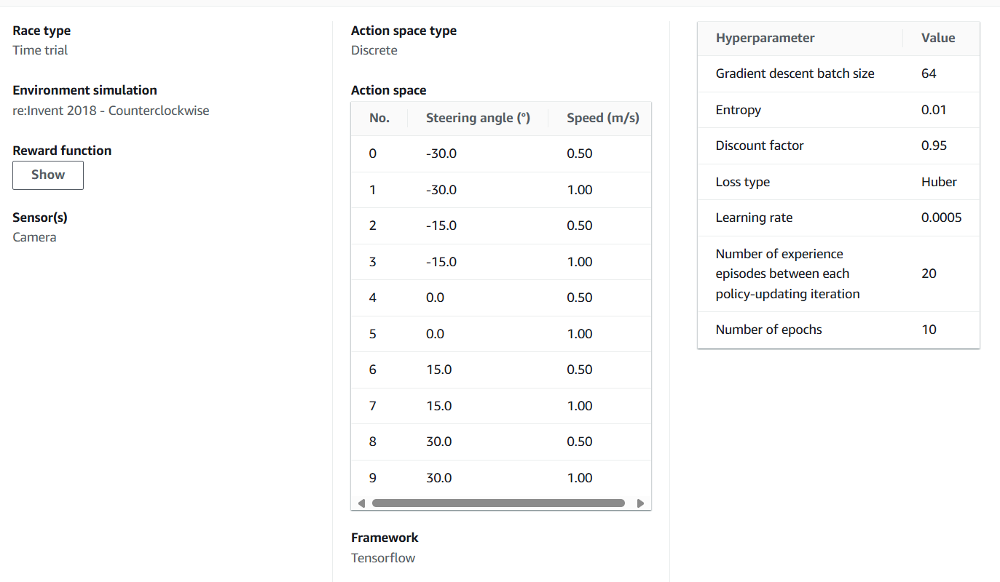
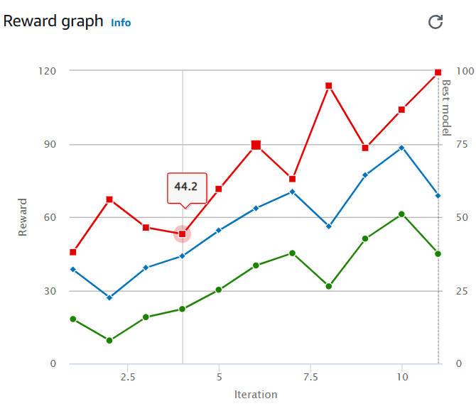

# deepracer2024
A repository for AWS Deepracer competition 2024, Maze Of Bone team.

# Models

Please display your models under it.

## lsh-vcar-2018-20241114-0

* Author: Li Shen

[Reward function](./models/lsh-vcar-2018-20241114-0/reward_funciton.py)

Env, action domain and hyperparameters:

Result:

## lsh-vcar-2018-20241114-1 (Clone from lsh-vcar-2018-20241114-0)

* Author: Li Shen

[Reward function](./models/lsh-vcar-2018-20241114-1/reward_funciton.py)

Env, action domain and hyperparameters:

Result:

Evaluation:

## FalkTanOptimizedTrack-reinvent2018-20241121-1

[Reward function](./models/FalkTanOptimizedTrack-reinvent2018-20241121-1/reward_funciton.py)

Env, action domain and hyperparameters:

Result:

Evaluation:

